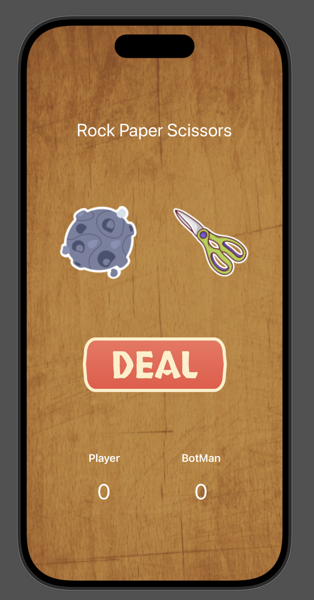
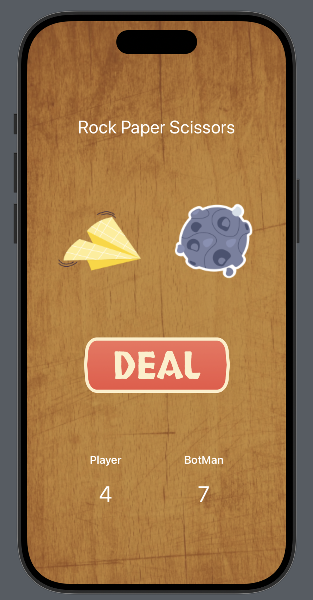
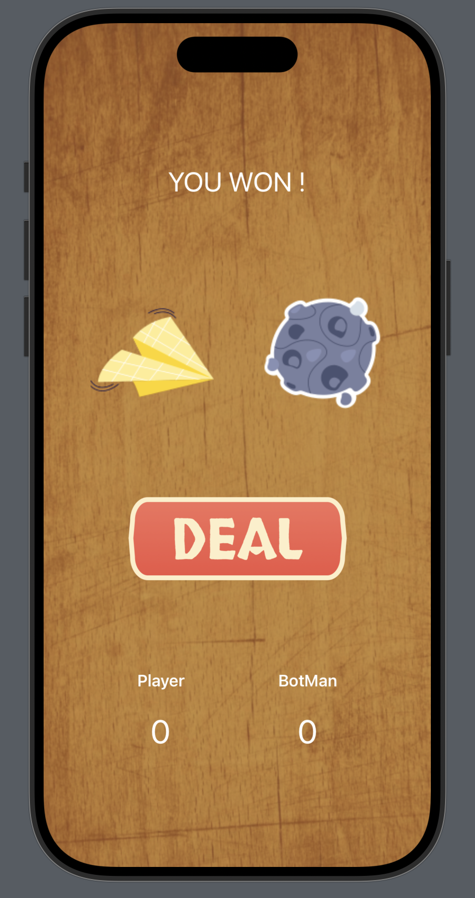

# RockPaperScissors

RockPaperScissors is an iOS app developed as part of a lab assignment for the course Mobile Computing Lab (CSE 3202) at Khulna University of Engineering and Technology. The game allows users to play a simple "Rock, Paper, Scissors" match against a computer opponent.

## Features
- Play the classic Rock-Paper-Scissors game against the computer.
- The first to score 10 points wins the match.
- View the current score of the player versus the computer.

## App Preview

